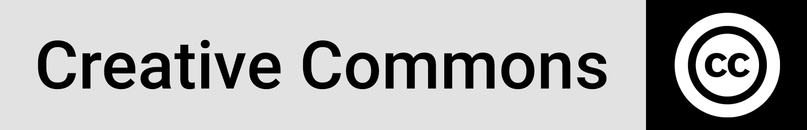

<h1 align="center">World Environment Day, 05 June 2022</a></h1>

<p align='center'>


</p>
<p align="center">
  <a href="#overview">Overview</a> •
  <a href="#Rationale and definition (SDG9c)">Rationale and Definition</a> •
  <a href="#Data Source">Data Source</a> •
  <a href="#Solution Architecture">Solution Architecture</a> •
  <a href="#networking">Networking</a> •
  <a href="#Reference">Reference</a> •
  <a href="#license">License</a>
</p>


## Overview

Led by the United Nations Environment Programme (UNEP) and held annually on 5 June since 1974, [World Environment Day](https://www.unep.org/events/un-day/world-environment-day-2022) is the largest global platform for environmental public outreach and is celebrated by millions of people across the world. This year it is hosted by Sweden.


## Rationale and Definition (#OnlyOneEarth)

**Earth faces a triple planetary emergency:**

- the climate is heating up too quickly for people and nature to adapt;
- habitat loss and other pressures mean an estimated 1 million species are threatened with extinction;
- pollution continues to poison our air, land and water.

The way out of this dilemma is to transform our economies and societies to make them inclusive, fair and more connected with nature. We must shift from harming the planet to healing it.

The good news is the solutions and the technology exist and are increasingly affordable.

**\#OnlyOneEarth** is the campaign for World Environment Day 2022. It calls for collective, transformative action on a global scale to celebrate, protect and restore our planet.

> “Only One Earth” was the slogan for the first United Nations Conference on the Human Environment, held in Stockholm in 1972. This put sustainable development on the global agenda and led to the establishment of World Environment Day. Fifty years later, Sweden is hosting Stockholm+50 from 2 to 3 June, and World Environment Day on 5 June.

**Source:** https://www.un.org/en/observances/environment-day


## Data Source

**1. UNDP Human Development Reports**: https://hdr.undp.org/en/data (identify relevant indicators)

- **UNDP API:** http://ec2-54-174-131-205.compute-1.amazonaws.com/API/Information.php (API Documentation Link/URL) - get indicator ids

- **Base URL:** http://ec2-54-174-131-205.compute-1.amazonaws.com/API/HDRO_API.php/

- **Parameters:**

  1. `country_code` e.g. country_code = 'LSO, ZAF, GBR'
  2. `indicator_id` e.g.  indicator_code='690706'
     - 169706-Expected years of schooling (years)

  3. `year` e.g. year = '2020, 2019, 2017,2018' `not specified in query used for this context`


```php
http://ec2-54-174-131-205.compute-1.amazonaws.com/API/HDRO_API.php/country_code=AGO,BWA,COM,COD,SWZ,LSO,MDG,MWI,MUS,MOZ,NAM,SYC,ZAF,TZA,ZMB,ZWE/indicator_id=46006
```

**2. World Bank Open Data:** https://data.worldbank.org/ (identify relevant indicators)

- **UNDP API:** https://datahelpdesk.worldbank.org/knowledgebase/articles/898581

- **Base URL:** http://api.worldbank.org/v2/

    ```php
    Output Format: The API supports the following four output formats.

    - XML format: http://api.worldbank.org/v2/country/all/indicator/SP.POP.TOTL?format=xml (paginated)
    - JSON format: http://api.worldbank.org/v2/country/all/indicator/SP.POP.TOTL?format=json (paginated)
    - JSONP format: http://api.worldbank.org/v2/country/all/indicator/SP.POP.TOTL?format=jsonP&prefix=Getdata  (invalid response)
    Note: For JSONP format, prefix parameter must be specified.
    - JSON-stat format: http://api.worldbank.org/v2/country/all/indicator/SP.POP.TOTL?format=jsonstat (usable - not paginated)
    ```

- **Parameters:**

    ```php
    http://api.worldbank.org/v2/country/AGO;BWA;COM;COD;SWZ;LSO;MDG;MWI;MUS;MOZ;NAM;SYC;ZAF;TZA;ZMB;ZWE/indicator/AG.LND.ARBL.ZS?format=jsonstat
    ```

    

**Analysis Context:** United Nations member countries


## Solution Architecture

**Focus Indicators**:

**UNDP**

- Fresh water withdrawals (% of total renewable water resources): https://hdr.undp.org/en/indicators/97106
- Natural resource depletion (% of GNI): https://hdr.undp.org/en/indicators/97306

**World Bank**

- Arable land (% of land area): https://data.worldbank.org/indicator/AG.LND.ARBL.ZS
- Forest area (% of land area): https://data.worldbank.org/indicator/AG.LND.FRST.ZS

❤️**Project Pyjstat** (Amazing libary simplified the data-pull tenfold)

**pyjstat** is a python library for **JSON-stat** formatted data manipulation which allows reading and writing JSON-stat [[1\]](https://pypi.org/project/pyjstat/#id4) format with python,using the DataFrame structures provided by the widely accepted pandas library [[2\]](https://pypi.org/project/pyjstat/#id5). The JSON-stat format is a simple lightweight JSON format for data dissemination, currently in its 2.0 version. Pyjstat is inspired in rjstat [[3\]](https://pypi.org/project/pyjstat/#id6), a library to read and write JSON-stat with R, by ajschumacher. Note that, like in the rjstat project, not all features are supported (i.e. not all metadata are converted). **pyjstat** is provided under the Apache License 2.0.

- **Library Documentation**: https://pypi.org/project/pyjstat/
- **Author**: [Miguel Expósito Martín](mailto:miguel.exposito@gmail.com)
- **Usage**: `pip install pyjstat`

M extract from the Power Query Editor

```python
let
    Source = Python.Execute("from pyjstat import pyjstat#(lf)#(lf)EXAMPLE_URL = 'http://api.worldbank.org/v2/country/All/indicator/AG.LND.ARBL.ZS?format=jsonstat'#(lf)#(lf)# read from json-stat#(lf)dataset = pyjstat.Dataset.read(EXAMPLE_URL)#(lf)#(lf)# write to dataframe#(lf)df = dataset.write('dataframe')#(lf)print(df)#(lf)#(lf)# read from dataframe#(lf)dataset_from_df = pyjstat.Dataset.read(df)#(lf)#(lf)# write to json-stat#(lf)print(dataset_from_df.write())"),
    df1 = Source{[Name="df"]}[Value],
    #"Replaced Value" = Table.ReplaceValue(df1,".",",",Replacer.ReplaceText,{"value"}),
    #"Changed Type" = Table.TransformColumnTypes(#"Replaced Value",{{"value", type number}}),
    #"Changed Type1" = Table.TransformColumnTypes(#"Changed Type",{{"Year", type date}}),
    #"Filtered Rows1" = Table.SelectRows(#"Changed Type1", each [Year] >= #date(2010, 1, 1))
in
    #"Filtered Rows1"
```


**Tufte's Principles on Data Visualisation**

- The representation of numbers, as physically measured on the surface of  the graphic itself, should be directly proportional to the numerical  quantities measured.
- Clear, detailed, and thorough labeling should be used to defeat  graphical distortion and ambiguity. Write out explanations of the data  on the graphic itself. Label important events in the data.
- Show data variation, not design variation. 
- In time-series displays of money, deflated and standardized units of  monetary measurement are nearly always better than nominal units. 
- The number of information-carrying (variable) dimensions depicted should not exceed the number of dimensions in the data. 
- Graphics must not quote data out of context.


**PowerBI Report**

View Report: <a href="https://app.powerbi.com/view?r=eyJrIjoiMGEyMzA5YzItYjZiNi00MDc3LWI2OTQtMWFhYmI2YTcyMzQ2IiwidCI6IjBhZGMyNjkxLThlNzAtNDNlZi05MTVjLWE5ZWZiMmIxMGY2YSJ9">PowerBI Report Link</a>

<p align="center"></p>

## Networking

Connecting and building networks is always part of our  priorities, please reach out if you have any ideas on collaborative  efforts or any suggestions on ways we could improve our work:

> **Website**: https://lmakoti.codepool.tech
>
> **LinkedIn**: https://www.linkedin.com/in/lehlohonolomakoti


## Reference 

- https://www.un.org/en/observances/environment-day, UN observance page (2022)
- https://pypi.org/project/pyjstat/, Project `pyjstat` (Aug 2021, Release: 2.2.1)
- The Visual Display of Quantitative Information, Edward Tufte (1983)
- https://www.linkedin.com/pulse/edward-tuftes-six-principles-graphical-integrity-radhika-raghu/, Linkedin article on Edward Tufte's design principles

## License

This license lets others distribute, remix, adapt, and build upon your  work, even commercially, as long as they credit you for the original  creation. This is the most accommodating of licenses offered.  Recommended for maximum dissemination and use of licensed materials. (https://creativecommons.org/licenses/)

****
